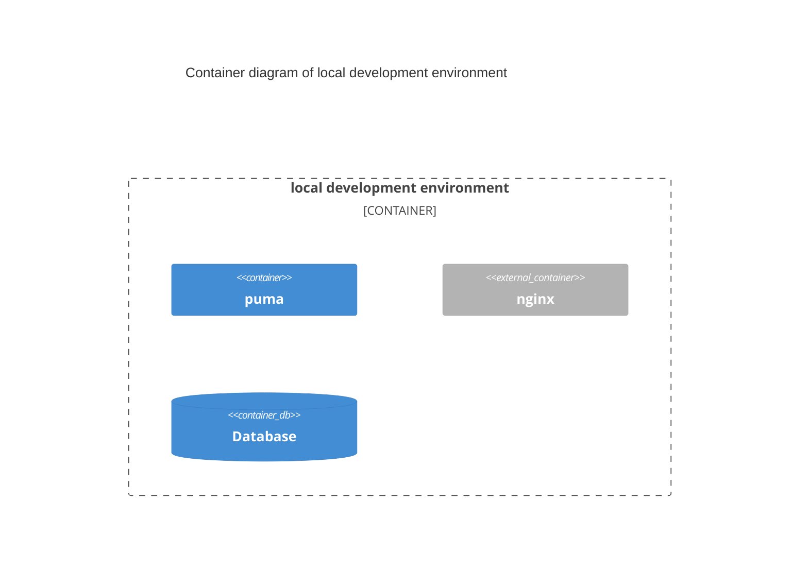

# 構成

```mermaid
    C4Container
    title Container diagram of local development environment

    Container_Boundary(c1, "local development environment") {
        Container(puma, "puma")
        Container_Ext(nginx, "nginx")
        ContainerDb(database, "Database")
    }
```

# capistrano